# aileens-clock
 A simple javascript timer to be used as an overlay for streaming

 ## Contents

 - [How to Use](#how-to-use)
 - [Installing and Running](#installing-and-running-the-clock)
 - [Displaying the Clock in OBS](#displaying-the-clock-in-obs)
 - [Configuring OBS Capture](#making-adjustments-to-our-capture)
 - [Changing the Background](#changing-the-background-image)

## <a id="how-to-use"></a> How to use

There are two main aspects of getting this clock to work for you. Running the clock, and displaying it in OBS.

### Installing and Running the Clock
In order to run the clock follow the below steps.

1. clone (download) this github repository.
2. navigate to the place where the repository is on your local machine and open up the file "index.html". You may do this with any browser of your choice.
3. Enjoy your clock!


### Displaying the clock in OBS.

#### 1. Be sure that your clock is running in your browser of choice. 

Make sure you run it in its own window since we will be using a window capture to display your clock. 

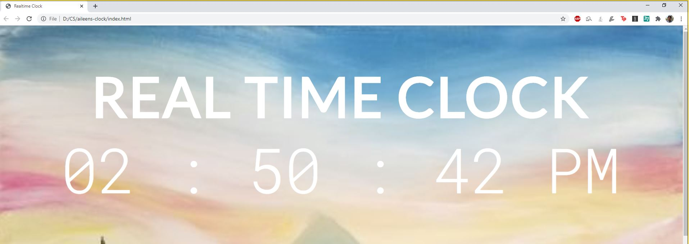

#### 2. Add a window capture of the clock in OBS

To add a window capture, click the plus button in the sources section near the bottom left of your screen.

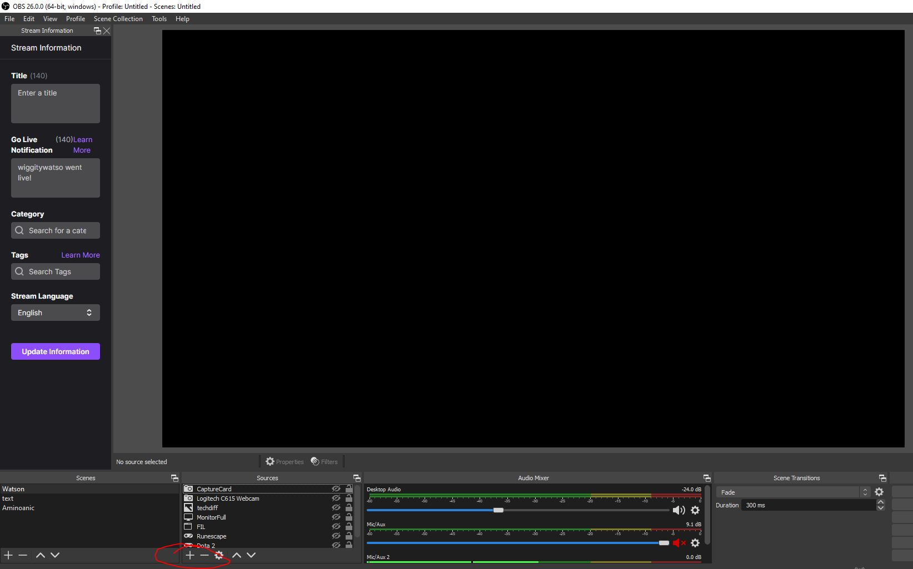

Choose window capture from the list that pops up

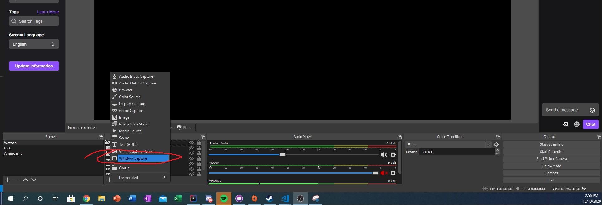

#### 3. Configure your clock capture

This will open up a dialog box for creating a new capture. Name your capture something relevant like "Realtime Clock Capture" and click OK.

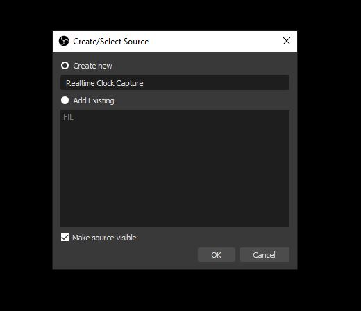

In the next dialog box, choose the window where your clock is running. You will see the clock display in a preview window.

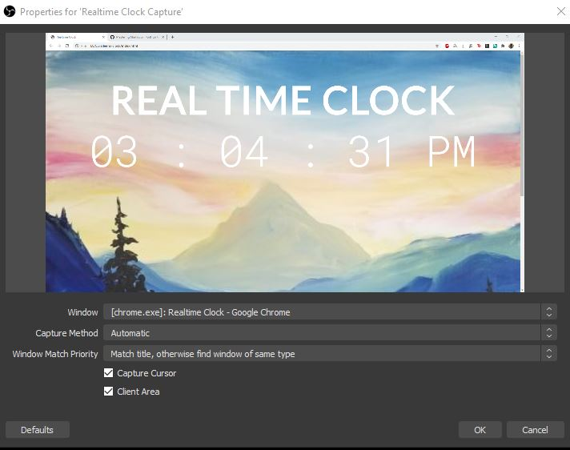

Set the Window Match Priority to "Window title must match" to ensure that the capture does not pick up some other chrome window. (If you have other tabs open in the window with the clock they may be captured when the clock closes so be careful.)

It is recommended to uncheck Capture Cursor, since you generally won't want the cursor to appear on the clock. After choosing those options, the settings menu will appear as follows:
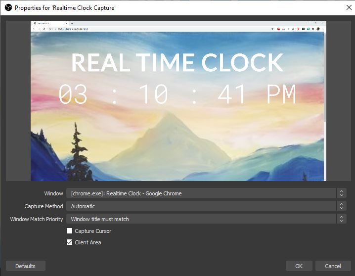

When you are sure that your settings match the above, click OK.

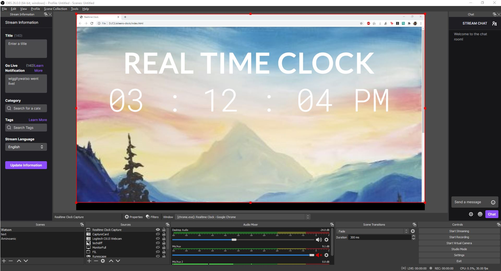

Now you can see your clock in OBS! However, it still doesn't look quite right. Next we will change its shape so it will fit nicely in the corner of our screen while we stream.

### Making adjustments to our capture

If you try adjusting the size and shape of the clock by clicking and dragging the red edges of the capture in OBS, you will notice that while you may change the size, you cannot change the aspect ratio.


In order to make the clock a different shape, you will need to reshape the Chrome window where the clock is running. Navigate to the window and pop it into windowed mode.

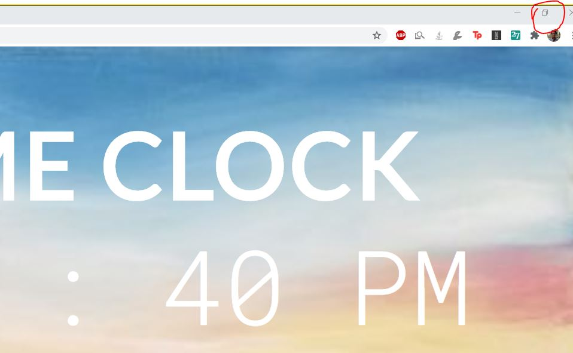

Once in windowed mode, you can click the edges of the Chrome window to change its size and shape.


Once you have a shape you are comfortable with, you can make size adjustments in OBS as shown before, and you can drag the clock to a position of your choice on screen. 

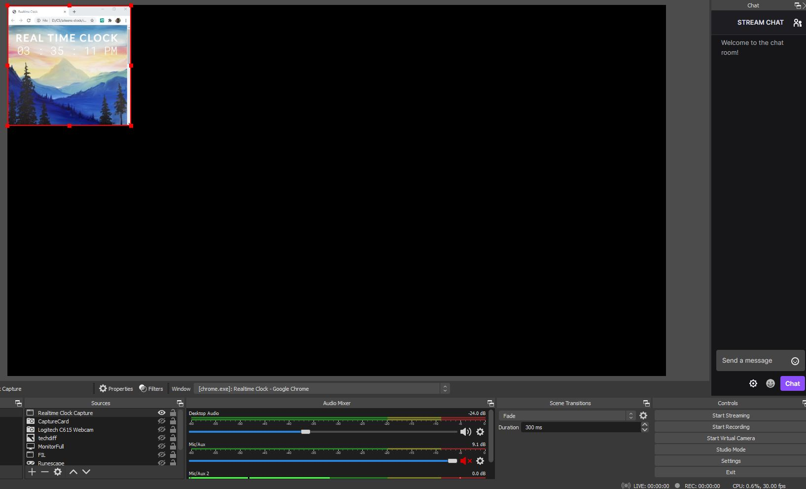

Looking good! But now we need to get rid of the navigation bar at the top as well as that pesky scroll bar. In order to do so, right click the clock window in OBS. Go to Transform, then Edit Transform.

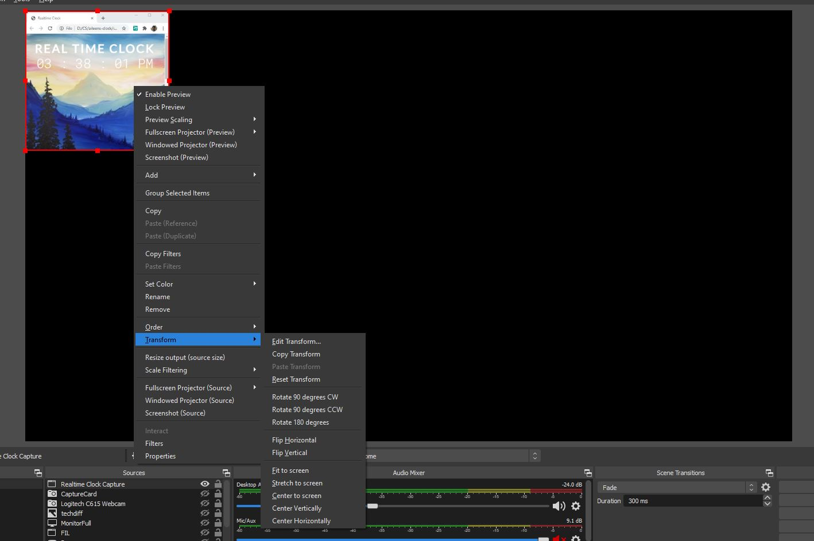

The resulting window will have controls where you can adjust the cropping of the capture. This will allow you to crop out unwanted parts of you capture. For example, I set Crop Top to 100 and Crop Right to 20 and it worked perfectly for my capture. 

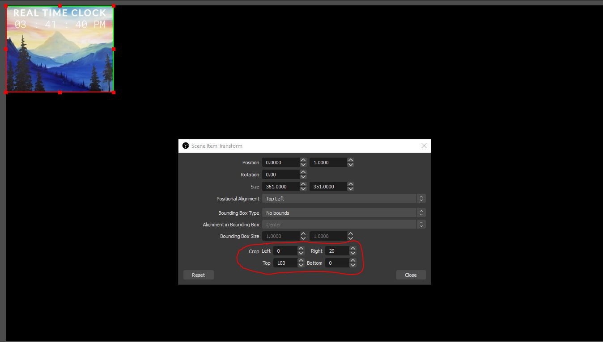

And now you've done it! A beautiful clock overlay for your stream. Feel free to play around with other OBS settings like transparancies to further customize to a look that you like. 

### Changing the background image

#### Step 1- Uploading your image
Everyone is a fan of landscape paintings of mountains, but sometimes you might want to swap those mountains for a verdant forest, a stunning desert, or perhaps a fun seasonal background for the holidays. Changing the background for your clock is pretty straightforward, but tread carefully. If done wrong the clock won't show anything at all! 

In order to change the image used as the background, open up the folder where the clock is saved and navigate to the 'image' folder. Within this folder is another folder called 'background'. Place your image of choice into this folder. Give it a name that is easily identifiable as you will have to remember it later!

This is where you background image should go: alongside the default background mountains.jpg. 

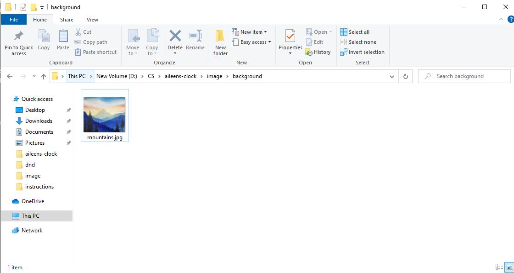


#### Step 2- Setting your image as the background image
Now that your image is available to the clock, you need to make sure the clock knows which image to use. Using a text editor, open up the index.html file. You need to locate the line  ``````. 

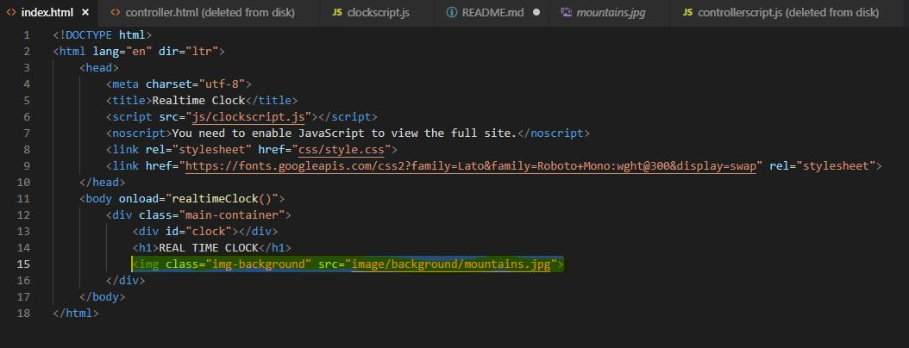

This line tells your browser which file to use as the background image. To change the background image, you will point the browser to your new file. Simply replace ```mountains.jpg``` with the name of the image file you uploaded to the image folder in step 1. 

)


Be certain the name is **EXACTLY** the same. It is case sensitive and any error will cause the clock to fail.

After making the change, save the index.html file and head over to your clock. If the changes don't display immediately try refreshing the page. If the page displays nothing there is likely a typo in the filename. Once you have several files uploaded to the image folder, you will be able to switch between them with ease by following only instructions in step 2. Have fun customizing your clock!

[Back to the top](#aileens-clock)